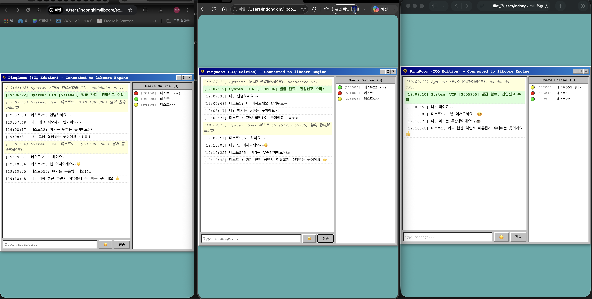
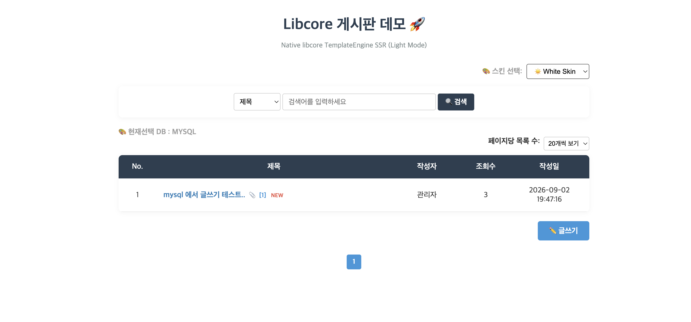
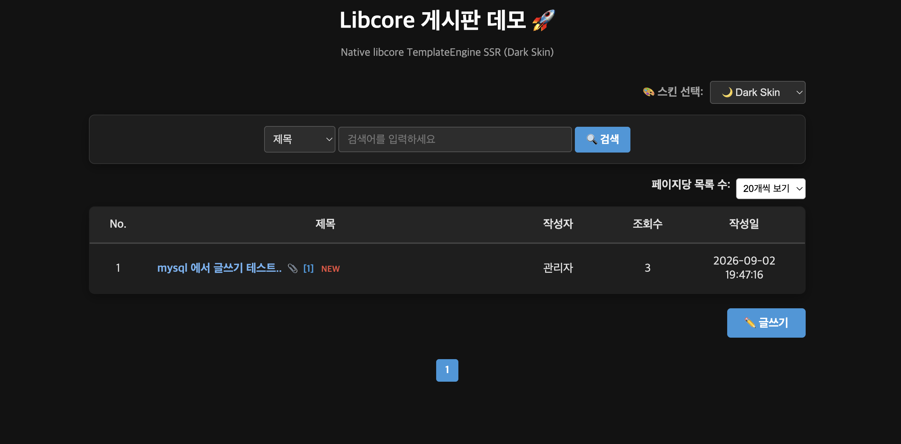
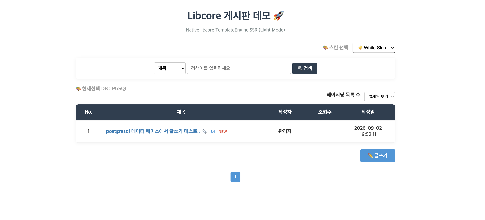
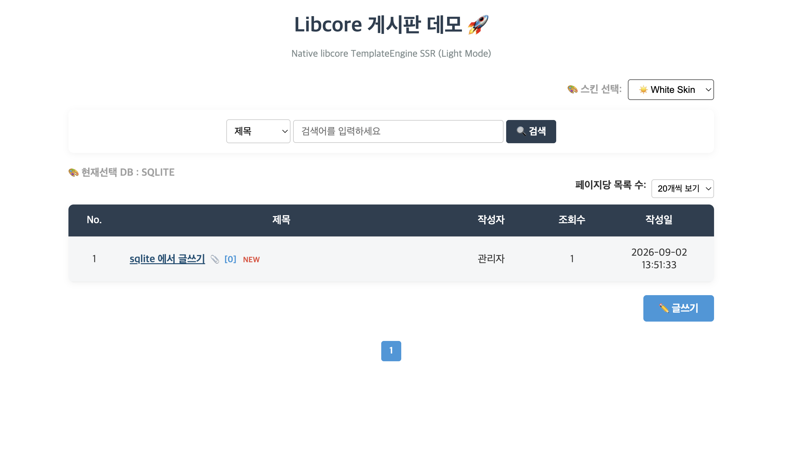

# libcore — C Server Runtime Framework

> **EventLoop + ThreadPool 기반, C 서버를 100줄로.**
> **Build a C server in 100 lines with EventLoop + ThreadPool.**

[](LICENSE)
[](/)
[](/)
[](/)

---

## 한 줄로

```
🇰🇷 C99 기반 서버 런타임 프레임워크.
     EventLoop + ThreadPool + ARC 메모리 관리로
     고성능 서버를 빠르게 만들 수 있습니다.
🇬🇧 A C99 server runtime framework.
     Build high-performance servers quickly with
     EventLoop + ThreadPool + ARC memory management.
```

---

## 이렇게 씁니다 / This is how you use it

```c
/* TCP 에코 서버 — 20줄 / TCP Echo Server — 20 lines */
#include "libcore.h"

static void on_client(Socket* self, void* loop_ptr) {
    char buf[1024];
    ssize_t n = self->recv(self, buf, sizeof(buf), NULL, NULL);
    if (n > 0) self->send(self, buf, n, NULL, 0);
    else {
        ((EventLoop*)loop_ptr)->delSocket((EventLoop*)loop_ptr, self);
        RELEASE((Object*)self);
    }
}

static void on_accept(Socket* self, void* loop_ptr) {
    EventLoop* loop = (EventLoop*)loop_ptr;
    TcpSocket* client = ((TcpSocket*)self)->accept((TcpSocket*)self, NULL, NULL);
    if (client) {
        client->base.on_readable = on_client;
        loop->addSocket(loop, (Socket*)client, EV_READ);
        RELEASE((Object*)client);
    }
}

int main(void) {
    EventLoop* loop   = new_EventLoop(1024);
    TcpSocket* server = new_TcpServer("0.0.0.0", 8080);
    server->base.on_readable = on_accept;
    loop->addSocket(loop, (Socket*)server, EV_READ);
    loop->run(loop);                          /* 블로킹 / blocking */
    RELEASE((Object*)server);
    RELEASE((Object*)loop);
    return 0;
}
```

---

## 왜 libcore인가 / Why libcore

```
🇰🇷
C 언어로 서버를 만들 때 반복되는 문제들:
→ epoll 직접 관리 → 복잡하고 실수하기 쉬움
→ 스레드 풀 직접 구현 → 매번 같은 코드
→ 메모리 관리 → free() 타이밍 실수 → 누수
→ 소켓 추상화 없음 → TCP/UDP/Unix 각각 따로

libcore 는 이 문제들을 해결합니다.

🇬🇧
When building servers in C, you face the same problems repeatedly:
→ Managing epoll directly — complex and error-prone
→ Implementing thread pools every time — same boilerplate
→ Memory management — wrong free() timing → leaks
→ No socket abstraction — TCP/UDP/Unix all separate

libcore solves these problems.
```

---

## 핵심 구성 / Core Components

```
┌─────────────────────────────────────────────────────┐
│                   libcore v1.7.2                    │
├─────────────────────────────────────────────────────┤
│                                                     │
│  ┌──────────────┐    ┌──────────────────────────┐   │
│  │  EventLoop   │◄───│  Socket                  │   │
│  │  epoll/kqueue│    │  TcpSocket / SslSocket   │   │
│  │              │◄───│  UdpSocket               │   │
│  │              │◄───│  UnixSocket              │   │
│  └──────┬───────┘    └──────────────────────────┘   │
│         │                                           │
│         │            ┌──────────────────────────┐   │
│         └───────────►│  Timer / Scheduler       │   │
│                      └──────────────────────────┘   │
│                                                     │
│  ┌──────────────┐    ┌──────────────────────────┐   │
│  │  ThreadPool  │    │  ARC Memory              │   │
│  │  Thread      │    │  RETAIN / RELEASE        │   │
│  │  Semaphore   │    │  Valgrind-clean          │   │
│  └──────────────┘    └──────────────────────────┘   │
│                                                     │
│  ┌──────────────────────────────────────────────┐   │
│  │  HTTP Layer                                  │   │
│  │  HttpServer / HttpClient / Router            │   │
│  │  PathValidator / StringBuilder / TextEncoder │   │
│  │  WebSocket / Cookie / Multipart              │   │
│  └──────────────────────────────────────────────┘   │
│                                                     │
│  Collections  String  JSON  Logger  Crypto  SNMP   │
└─────────────────────────────────────────────────────┘
```

---

## 주요 특징 / Key Features

| 특징 / Feature | 설명 / Description |
|---|---|
| **EventLoop** | Linux: epoll / macOS: kqueue — OS 자동 감지 |
| **ARC 메모리** | RETAIN/RELEASE 기반 자동 메모리 관리 / Auto memory via RETAIN/RELEASE |
| **Socket 추상화** | TCP/UDP/Unix/SSL 통일 인터페이스 / Unified TCP/UDP/Unix/SSL interface |
| **ThreadPool** | 작업 큐 기반 스레드 풀 / Task queue-based thread pool |
| **HTTP 스택** | HttpServer/HttpClient/Router/:id/WebSocket/Cookie/Multipart |
| **PathValidator** | Rule 16 기반 경로 보안 검증 / Rule 16 path security validation |
| **StringBuilder** | ByteBuffer 기반 ARC 호환 문자열 빌더 / ARC-compatible string builder |
| **TextEncoder** | escapeHtml/urlEncode/base64/Zero-Alloc API |
| **73개 C 소스 파일** | 컬렉션/파일/암호화/JSON/SNMP/HTTP/DB 등 / 73 C source files |

---

## 빠른 시작 / Quick Start

### 1. 빌드 / Build

```bash
git clone https://github.com/toursmurf/libcore.git
cd libcore
make examples
```

빌드 시 OS가 자동으로 감지됩니다 / OS is auto-detected at build time:

```
# Rocky Linux 9.x (epoll)
=========================================
 libcore Build Configuration (v1.7.2)
=========================================
 Target OS  : Linux
 Backend    : epoll
 OpenSSL    : 3.5.1
=========================================

# macOS Apple Silicon (kqueue)
=========================================
 libcore Build Configuration (v1.7.2)
=========================================
 Target OS  : macOS
 Backend    : kqueue
 OpenSSL    : 3.6.3
=========================================
```

### 2. 예제 실행 / Run Examples

```bash
# 통합 테스트 / Integration test
./examples/all_test_v2

# TCP 에코 서버 / TCP echo server
./examples/arc_echo_server

# 멀티 프로토콜 리액터 / Multi-protocol reactor
./examples/arc_reactor_multi_server

# 웹게시판 서버 프로그램
./examples/arc_board_server

# 네이버 뉴스 병렬 크롤러 / Naver news parallel crawler
./examples/arc_naver_news

# 프로세스 모니터링 에이전트 / Process monitoring agent (RockyLinux8.10/9.8)
./examples/arc_process_agent
```

### 3. RDB 연동 / RDB Integration

```text
MySQL / MariaDB
PostgreSQL
SQLite
```

→ MySQL 설정 예시: [docs/mysql_setup.md](docs/mysql_setup.md)

---

## 사용 시나리오 / Use Cases

```
🇰🇷 이런 것을 만들 때 씁니다:
✔ TCP/UDP 서버 (단일 EventLoop, 다중 클라이언트)
✔ IPC 서버 (Unix Domain Socket)
✔ 멀티 프로토콜 서버 (TCP + UDP + Unix 동시)
✔ HTTP/HTTPS REST API 서버
✔ WebSocket 실시간 채팅 서버
✔ 주기적 작업 서버 (Scheduler + ThreadPool)
✔ 고성능 데이터 수집기 (병렬 크롤러 + ThreadPool)
✔ SNMP 네트워크 관리 에이전트

🇬🇧 Build these with libcore:
✔ TCP/UDP servers (single EventLoop, multiple clients)
✔ IPC servers (Unix Domain Socket)
✔ Multi-protocol servers (TCP + UDP + Unix simultaneously)
✔ HTTP/HTTPS REST API servers
✔ WebSocket real-time chat servers
✔ Periodic task servers (Scheduler + ThreadPool)
✔ High-performance data collectors (parallel crawler + ThreadPool)
✔ SNMP network management agents
```

---

## ARC 메모리 규칙 / ARC Memory Rules

```c
/*
 * 🇰🇷 3가지만 기억하세요:
 * 🇬🇧 Just remember 3 rules:
 *
 * 1. new_xxx() 생성 시 ref_count = 1 자동
 *    new_xxx() sets ref_count = 1 automatically
 *
 * 2. 컨테이너가 저장 시 RETAIN하며, 호출자는 자신의 소유권을 다 쓰면 RELEASE
 *    Containers RETAIN objects when storing them;
 *    callers RELEASE their own ownership when done.
 *
 * 3. [OWNED] 반환값은 RELEASE 필수
 *    [BORROWED] 반환값은 RELEASE 금지
 *    Must RELEASE [OWNED], never RELEASE [BORROWED]
 */
ArrayList* list = new_ArrayList(10);         /* ref=1 */
String*    str  = new_String("hello");       /* ref=1 */
list->add(list, (Object*)str);               /* 내부 RETAIN → ref=2 */
RELEASE((Object*)str);                       /* ref=1, list 가 소유 */
String* item = (String*)list->get(list, 0);  /* [BORROWED] RELEASE 금지 */
RELEASE((Object*)list);                      /* list + str 전부 소각 */
```

---

## 모듈 구성 / Module Overview

```
Collections   ArrayList / HashMap / Hashtable / Queue / Stack
              Vector / List / LinkedList / BTree / Tree / JSON

Concurrency   Thread / ThreadPool / Semaphore
              RingBuffer / Mutex / RWLock / CondVar

Network       Socket / TcpSocket / UdpSocket / UnixSocket / SslSocket
              EventLoop (epoll / kqueue) / Timer / Scheduler / ByteBuffer

HTTP Layer    HttpServer / HttpClient / HttpTransport
              Router (동적 :id 파라미터) / Cookie
              PathValidator / StringBuilder / TextEncoder
              WebSocket / Multipart

File/IO       Path / File / Directory / FileWatcher / MappedFile
              FileUtil / AsyncFile

Application   AppContext / Context / Config / ServiceRegistry

Protocol      SNMP / ASN.1 / CoreSNMP

Utilities     Logger / AsyncLogger / Exception
              Crypto (SHA-256/SHA-512/AES-256-CBC/Base64)
              String / Locale / Regex / DateTime

WebBoard      BoardHandler / BoardTemplateEngine
```

---

## 예제 목록 / Examples

| 파일 / File                      | 설명 / Description                                              |
|----------------------------------|-----------------------------------------------------------------|
| `all_test_v2.c`                  | 전체 통합 테스트 37개 / 37 integration tests                    |
| `arc_echo_server.c`              | TCP 에코 서버 / TCP Echo Server                                 |
| `arc_reactor_multi_server.c`     | TCP+UDP+Unix 멀티플렉싱 / Multiplexing                          |
| `arc_http_client_test.c`         | HTTPS 클라이언트 / HTTPS Client                                 |
| `arc_naver_news.c`               | 병렬 뉴스 크롤러 90건 / Parallel news crawler                   |
| `arc_news_crawler.c`             | 다국어 뉴스 크롤러 / Multi-source news crawler                  |
| `arc_process_agent.c`            | 프로세스 모니터링 에이전트 / Process monitoring agent           |
| `arc_thread_test.c`              | ThreadPool 동작 검증 / ThreadPool test                          |
| `arc_scheduler_system_monitor.c` | 주기 모니터링 / Periodic monitoring                             |
| `arc_json_test.c`                | JSON 파서 / JSON parser                                         |
| `arc_crypto_integration_test.c`  | SHA/AES 암호화 / SHA/AES crypto                                 |
| `arc_snmp_parallel_walk.c`       | SNMP 병렬 수집 / SNMP parallel walk                             |
| `arc_mysql_test.c`               | MySQL 연동 / MySQL integration                                  |
| `compare_raw_vs_libcore.c`       | RAW epoll vs libcore 벤치마크 / Benchmark (RockyLinux서 테스트) |
| `arc_chat_server.c`              | chatting server (icq, kakaotalk)                                |
| `arc_board_server.c`             | 웹게시판 서버 프로그램 (MySQL / PostgreSQL / SQLite)            |

→ 전체 목록: [docs/examples.ko.md](docs/examples.ko.md)

---

## 🚀 Chat Demo support (RockyLinux-8.10/9.8 ,  MacBook Pro (Apple M2 Max)  tested)



## 🚀 WebBoard Demo — Multi-RDB Support

libcore v1.7.2 WebBoard runs on the same application code
with MySQL/MariaDB, PostgreSQL, and SQLite backends.

### MySQL / MariaDB

skin: white



skin: dark



### PostgreSQL



### SQLite



> Same BoardHandler / Router / TemplateEngine SSR,
> different DBClient adapters.

---

## 버전 히스토리 / Version History

| 버전 / Version | 주요 내용 / Highlights                                            |
|---|-------------------------------------------------------------------|
| **v1.7.2** | 3 RDB 지원용 웹게시판 (MySQL / PostgreSQL / SQLite)               |
| **v1.7.1** | Router params 2-Pass engine, OOM/NPD defense                      |
| **v1.7.0** | macOS (kqueue) 정식 지원 — Linux + macOS 멀티플랫폼               |
| **v1.6.2** | Content-Length 바운드 검증, WS 프레임 상한, EventLoop Object 상속 |
| **v1.6.1** | CSS filter, HTML entity decoding 안정화                           |
| **v1.6.0** | PathValidator / StringBuilder / TextEncoder / Router :id          |
| **v1.5.2** | webcore: Router parameter validation & Global Error Handling      |
| **v1.5.1** | json, event loop 수정                                             |
| **v1.5.0** | WebCore 완성 — HttpServer/HttpClient/SSL/Router/Cookie            |
| **v1.0** | Iron Fortress — 67모듈, Valgrind 0 bytes, CI 5관왕                |

---

## 플랫폼 지원 / Platform Support

| OS                              | 백엔드 / Backend | 상태 / Status           |
|---------------------------------|------------------|-------------------------|
| Rocky Linux 8.10 / 9.x (64-bit) | epoll            | ✅ 테스트 완료 / Tested |
| macOS (Apple Silicon)           | kqueue           | ✅ 테스트 완료 / Tested |
| Windows                         | IOCP             | 🔜 예정                 |

> Ubuntu, Debian, macOS Intel 등 기타 환경은 현재 v1.7.2에서 별도 검증되지 않았습니다.  
> Other environments have not been independently verified for v1.7.2.

---

## 문서 / Documentation

| 문서 / Document                                                              | 내용 / Content                            |
|------------------------------------------------------------------------------|-------------------------------------------|
| [docs/coding_guide_ko.md](docs/coding_guide_ko.md)                           | 코딩가이드 한글 / Korean Coding Guide     |
| [docs/coding_guide_en.md](docs/coding_guide_en.md)                           | English Coding Guide                      |
| [docs/CODING_CONTRACT_KO.md](docs/CODING_CONTRACT_KO.md)                     | 코딩규약 한글 / Korean Coding Contract    |
| [docs/CODING_CONTRACT_EN.md](docs/CODING_CONTRACT_EN.md)                     | English Coding Guide                      |
| [docs/libcore_v1.7.2_API_Reference.md](docs/libcore_v1.7.2_API_Reference.md) | v1.7.2 API Reference                      |
| [docs/libcore_v1_class_diagram.md](docs/libcore_v1_class_diagram.md)         | 클래스 다이어그램 / Class diagram         |
| [docs/mysql_setup.md](docs/mysql_setup.md)                                   | MySQL 연동 / MySQL setup                  |
| [docs/examples.ko.md](docs/examples.ko.md)                                   | 예제 가이드 한글 / Korean examples guide  |
| [docs/examples.en.md](docs/examples.en.md)                                   | 예제 가이드 영문 / English examples guide |

---

## 요구사항 / Requirements

```
OS       : Rocky Linux (9.8 / 8.10)  (64-bit)
           macOS - MacBook Pro (Apple M2 Max) (Apple Silicon)

Compiler : GCC 9+ / Clang 10+
Make     : GNU Make
OpenSSL  : 3.x (HTTPS/SSL 지원 / for HTTPS/SSL)

Optional :
           MariaDB / MySQL client library
           PostgreSQL libpq
           SQLite3
```

---

## 라이선스 / License

MIT License — 자유롭게 사용, 수정, 배포 가능.  
MIT License — Free to use, modify, and distribute.

---

## 링크 / Links

- Author : INDONG KIM(김인동) - idong322@naver.com
- **GitHub**: https://github.com/toursmurf/libcore
- **Homepage**: https://toos.it
- **Issues**: https://github.com/toursmurf/libcore/issues

---

*libcore is a high-performance, event-driven server runtime in pure C.*  
*Java-like API / Python-like usability / C-level performance / ARC memory safety.*  
*Valgrind clean / Graceful shutdown / MIT License.*

**libcore v1.7.2**