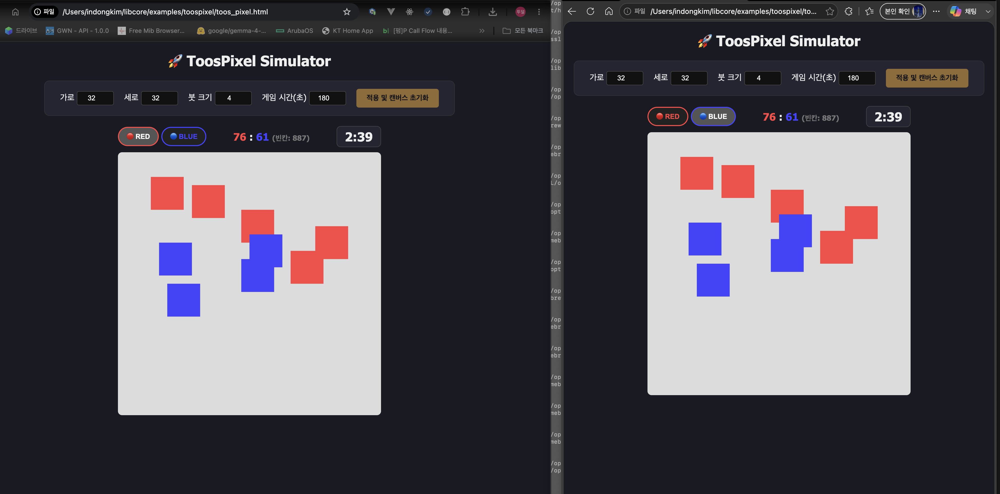
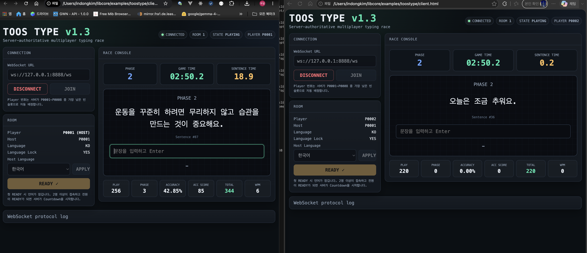
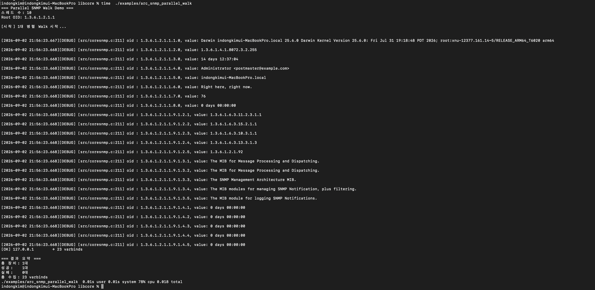

# libcore — C Server Runtime Framework

> **EventLoop + ThreadPool 기반, C 서버를 100줄로.**  
> **Build a C server in ~100 lines with EventLoop + ThreadPool.**

[](LICENSE)
[](/)
[](/)
[](/)

---

## 한 줄로 / In One Line

```text
🇰🇷 C99 기반 서버 런타임 프레임워크.
     EventLoop + ThreadPool + 참조 카운팅 메모리 관리로
     고성능 서버 애플리케이션을 빠르게 만들 수 있습니다.

🇬🇧 A C99 server runtime framework.
     Build high-performance server applications quickly with
     EventLoop + ThreadPool + reference-counted memory management.
```

---

## 이렇게 씁니다 / This Is How You Use It

```c
/* TCP 에코 서버 / TCP Echo Server */
#include "libcore.h"

static void on_client(Socket* self, void* loop_ptr) {
    char buf[1024];

    ssize_t n = self->recv(self, buf, sizeof(buf), NULL, NULL);

    if (n > 0) {
        self->send(self, buf, n, NULL, 0);
    } else {
        EventLoop* loop = (EventLoop*)loop_ptr;
        loop->delSocket(loop, self);
        RELEASE((Object*)self);
    }
}

static void on_accept(Socket* self, void* loop_ptr) {
    EventLoop* loop = (EventLoop*)loop_ptr;

    TcpSocket* client =
        ((TcpSocket*)self)->accept((TcpSocket*)self, NULL, NULL);

    if (client) {
        client->base.on_readable = on_client;
        loop->addSocket(loop, (Socket*)client, EV_READ);

        /*
         * EventLoop owns the registered socket.
         * Caller releases its own ownership.
         */
        RELEASE((Object*)client);
    }
}

int main(void) {
    EventLoop* loop   = event_loop_create();
    TcpSocket* server = new_TcpServer("0.0.0.0", 8080);

    server->base.on_readable = on_accept;

    loop->addSocket(loop, (Socket*)server, EV_READ);

    loop->run(loop);  /* blocking */

    RELEASE((Object*)server);
    RELEASE((Object*)loop);

    return 0;
}
```

---

## 왜 libcore인가 / Why libcore

```text
🇰🇷

C 언어로 서버를 만들면 반복해서 만나게 되는 문제들이 있습니다.

→ epoll / kqueue 직접 관리
→ 소켓 수명과 이벤트 등록 해제 관리
→ ThreadPool 반복 구현
→ Timer / Scheduler 구현
→ free() 타이밍 실수와 메모리 누수
→ TCP / UDP / Unix / SSL 별도 처리
→ HTTP / WebSocket / Router 반복 구현

libcore는 이런 반복 작업을 하나의 C99 서버 런타임으로 묶습니다.


🇬🇧

C server development repeatedly involves the same problems:

→ Managing epoll / kqueue directly
→ Managing socket lifetime and event registration
→ Reimplementing thread pools
→ Implementing timers and schedulers
→ Memory leaks caused by ownership mistakes
→ Separate handling for TCP / UDP / Unix / SSL
→ Reimplementing HTTP / WebSocket / routing layers

libcore brings these components together
into a reusable C99 server runtime.
```

---

## 핵심 구성 / Core Components

```text
┌──────────────────────────────────────────────────────────┐
│                     libcore v1.7.2                       │
├──────────────────────────────────────────────────────────┤
│                                                          │
│   ┌─────────────────┐      ┌─────────────────────────┐   │
│   │   EventLoop     │◄─────│ Socket                  │   │
│   │                 │      │ TcpSocket               │   │
│   │ Linux : epoll   │      │ UdpSocket               │   │
│   │ macOS : kqueue  │      │ UnixSocket              │   │
│   │                 │      │ SslSocket               │   │
│   └────────┬────────┘      └─────────────────────────┘   │
│            │                                             │
│            ├────────────► Timer / Scheduler               │
│            │                                             │
│            └────────────► WebSocket / HTTP                │
│                                                          │
│   ┌─────────────────┐      ┌─────────────────────────┐   │
│   │ ThreadPool      │      │ ARC-style Ownership     │   │
│   │ Thread          │      │ RETAIN / RELEASE        │   │
│   │ Semaphore       │      │ Valgrind-clean          │   │
│   └─────────────────┘      └─────────────────────────┘   │
│                                                          │
│   ┌──────────────────────────────────────────────────┐   │
│   │ HTTP Layer                                       │   │
│   │ HttpServer / HttpClient / HttpTransport          │   │
│   │ Router / Cookie / Multipart / WebSocket          │   │
│   │ PathValidator / StringBuilder / TextEncoder      │   │
│   └──────────────────────────────────────────────────┘   │
│                                                          │
│   Collections / String / JSON / Logger / Crypto / SNMP  │
│   MySQL / PostgreSQL / SQLite                           │
│                                                          │
└──────────────────────────────────────────────────────────┘
```

---

## 주요 특징 / Key Features

| 특징 / Feature | 설명 / Description |
|---|---|
| **EventLoop** | Linux: epoll / macOS: kqueue — OS 자동 감지 |
| **Reference-counted Memory** | RETAIN / RELEASE 기반 객체 수명 관리 |
| **Socket 추상화** | TCP / UDP / Unix / SSL 통합 인터페이스 |
| **ThreadPool** | 작업 큐 기반 ThreadPool |
| **Timer / Scheduler** | EventLoop 기반 Timer와 주기적 작업 |
| **HTTP Stack** | HttpServer / HttpClient / HttpTransport |
| **Router** | 동적 `:id` 파라미터 지원 |
| **WebSocket** | 실시간 양방향 통신 |
| **Cookie / Multipart** | HTTP 애플리케이션 지원 |
| **PathValidator** | Rule 16 기반 경로 보안 검증 |
| **StringBuilder** | ByteBuffer 기반 ARC 호환 문자열 빌더 |
| **TextEncoder** | HTML escape / URL encode / Base64 / Zero-Alloc API |
| **RDB Support** | MySQL / MariaDB / PostgreSQL / SQLite |
| **SNMP** | ASN.1 / CoreSNMP / SNMP Walk |
| **Cross Platform** | Rocky Linux epoll / macOS kqueue |

---

# 빠른 시작 / Quick Start

## 1. 빌드 / Build

```bash
git clone https://github.com/toursmurf/libcore.git
cd libcore

make examples
```

빌드 시 운영체제와 EventLoop backend가 자동으로 선택됩니다.

The operating system and EventLoop backend are selected automatically.

### Rocky Linux

```text
=========================================
 libcore Build Configuration (v1.7.2)
=========================================
 Target OS  : Linux
 Backend    : epoll
 OpenSSL    : 3.5.1
=========================================
```

### macOS Apple Silicon

```text
=========================================
 libcore Build Configuration (v1.7.2)
=========================================
 Target OS  : macOS
 Backend    : kqueue
 OpenSSL    : 3.6.3
=========================================
```

---

## 2. 예제 실행 / Run Examples

```bash
# 통합 테스트 / Integration test
./examples/all_test_v2

# TCP 에코 서버
./examples/arc_echo_server

# TCP + UDP + Unix 멀티 프로토콜 Reactor
./examples/arc_reactor_multi_server

# 웹게시판 서버
./examples/arc_board_server

# WebSocket 채팅 데모
./examples/arc_chat_server

# SNMP Parallel Walk
./examples/arc_snmp_parallel_walk

# 프로세스 모니터링 에이전트
./examples/arc_process_agent

# RED vs BLUE Pixel multiplayer game
./examples/arc_pixel_server

# Multiplayer typing game
./examples/arc_toos_type_server
```

---

## 3. RDB 연동 / RDB Integration

```text
MySQL / MariaDB
PostgreSQL
SQLite
```

MySQL 설정: [docs/mysql_setup.md](docs/mysql_setup.md)

---

# 사용 시나리오 / Use Cases

```text
🇰🇷 이런 것을 만들 때 사용할 수 있습니다.

✔ TCP / UDP 서버
✔ Unix Domain Socket IPC 서버
✔ TCP + UDP + Unix 멀티 프로토콜 서버
✔ HTTP / HTTPS REST API 서버
✔ WebSocket 실시간 서버
✔ 주기적 작업 서버
✔ ThreadPool 기반 병렬 작업 서버
✔ 네트워크 데이터 Collector
✔ SNMP 네트워크 관리 프로그램
✔ 실시간 채팅 서버
✔ 멀티플레이 게임 서버
✔ 웹 애플리케이션 서버


🇬🇧 Build applications such as:

✔ TCP / UDP servers
✔ Unix Domain Socket IPC servers
✔ Multi-protocol servers
✔ HTTP / HTTPS REST APIs
✔ WebSocket real-time servers
✔ Periodic task servers
✔ ThreadPool-based parallel workers
✔ Network data collectors
✔ SNMP management applications
✔ Real-time chat servers
✔ Multiplayer game servers
✔ Web application servers
```

---

# ARC 메모리 규칙 / Ownership Rules

libcore는 `RETAIN / RELEASE` 기반의 참조 카운팅 객체 수명 관리 방식을 사용합니다.

libcore uses reference-counted object ownership based on `RETAIN / RELEASE`.

```c
/*
 * 🇰🇷 3가지만 기억하세요.
 *
 * 1. new_xxx() 로 생성된 객체는 ref_count = 1
 *
 * 2. 컨테이너가 객체를 저장할 때 RETAIN
 *    호출자는 자신의 ownership을 다 쓰면 RELEASE
 *
 * 3. [OWNED] 반환값은 RELEASE 필요
 *    [BORROWED] 반환값은 RELEASE 금지
 *
 *
 * 🇬🇧 Remember three rules.
 *
 * 1. new_xxx() returns an object with ref_count = 1
 *
 * 2. Containers RETAIN stored objects.
 *    Callers RELEASE their own ownership when finished.
 *
 * 3. RELEASE [OWNED] results.
 *    Never RELEASE [BORROWED] results.
 */
```

예제:

```c
ArrayList* list = new_ArrayList(10);        /* ref=1 */

String* str = new_String("hello");          /* ref=1 */

list->add(list, (Object*)str);               /* RETAIN → ref=2 */

RELEASE((Object*)str);                       /* ref=1, owned by list */

String* item =
    (String*)list->get(list, 0);             /* [BORROWED] */

/* RELEASE(item) 하면 안 됨 */

RELEASE((Object*)list);                      /* list + str cleanup */
```

---

# 모듈 구성 / Module Overview

```text
Collections
    ArrayList / HashMap / Hashtable / Queue / Stack
    Vector / List / LinkedList / BTree / Tree / JSON

Concurrency
    Thread / ThreadPool / Semaphore
    RingBuffer / Mutex / RWLock / CondVar

Network
    Socket / TcpSocket / UdpSocket / UnixSocket / SslSocket
    EventLoop / Timer / Scheduler / ByteBuffer

HTTP Layer
    HttpServer / HttpClient / HttpTransport
    Router / Cookie / Multipart / WebSocket
    PathValidator / StringBuilder / TextEncoder

File / IO
    Path / File / Directory / FileWatcher
    MappedFile / FileUtil / AsyncFile

Application
    AppContext / Context / Config / ServiceRegistry

Database
    MySQL / MariaDB / PostgreSQL / SQLite

Protocol
    SNMP / ASN.1 / CoreSNMP

Utilities
    Logger / AsyncLogger / Exception / Crypto
    String / Locale / Regex / DateTime

WebBoard
    BoardHandler / BoardTemplateEngine
```

---

# 예제 목록 / Examples

> 아래 표는 대표 예제만 표시합니다. 전체 54개 예제는
> [docs/examples.ko.md](docs/examples.ko.md)를 참고하세요.
>
> The table below lists selected examples only.
> See [docs/examples.en.md](docs/examples.en.md) for the complete set of 54 examples.

| 파일 / File | 설명 / Description |
|---|---|
| `all_test_v2.c` | 전체 통합 테스트 |
| `arc_echo_server.c` | TCP Echo Server |
| `arc_reactor_multi_server.c` | TCP + UDP + Unix multiplexing |
| `arc_http_client_test.c` | HTTPS Client |
| `arc_process_agent.c` | Process monitoring agent |
| `arc_thread_test.c` | Thread / ThreadPool test |
| `arc_scheduler_system_monitor.c` | Periodic monitoring |
| `arc_json_test.c` | JSON parser |
| `arc_crypto_integration_test.c` | SHA / AES crypto |
| `arc_snmp_parallel_walk.c` | Parallel SNMP Walk |
| `arc_mysql_test.c` | MySQL integration |
| `compare_raw_vs_libcore.c` | RAW epoll vs libcore benchmark |
| `arc_chat_server.c` | WebSocket chat server |
| `arc_board_server.c` | WebBoard server |
| `arc_pixel_server.c` | RED vs BLUE multiplayer Pixel game |
| `arc_toos_type_server.c` | Multiplayer typing game |

---

# 💬 Chat Demo — Multi-Client Communication

WebSocket 기반 멀티 클라이언트 채팅 데모입니다.

WebSocket-based multi-client chat demo.

**Tested**

```text
Rocky Linux 8.10
Rocky Linux 9.x
macOS Apple Silicon
```


---

# 🚀 WebBoard Demo — Multi-RDB Support

libcore v1.7.2 WebBoard는 동일한 애플리케이션 코드에서

```text
MySQL / MariaDB
PostgreSQL
SQLite
```

를 사용할 수 있습니다.

The same WebBoard application runs with multiple RDB backends.

## MySQL / MariaDB

### White Skin


### Dark Skin


## PostgreSQL


## SQLite


```text
Same application layer:

BoardHandler
Router
TemplateEngine SSR

Different database adapters.
```

---

# 🎨 PixelBoard Demo — RED vs BLUE

Real-time RED vs BLUE multiplayer game powered by

```text
HttpServer + WebSocket + EventLoop
```

주요 기능:

- Server-authoritative game state
- Multi-client real-time synchronization
- RED / BLUE team assignment
- Pixel / Score synchronization
- Host player management
- Player paint cooldown
- Configurable board size / brush size
- Game timeout / Automatic GAME_OVER
- Linux epoll / macOS kqueue
- Valgrind tested — 0 errors / 0 bytes leaked



---

# ⌨️ ToosType Demo — Multiplayer Typing Race

Real-time multiplayer typing race powered by

```text
HttpServer + WebSocket + EventLoop + SQLite
```

ToosType demonstrates a complete real-time multiplayer game
running on top of the libcore runtime.

주요 기능:

- Server-authoritative game state
- 2–8 multiplayer clients
- Host / Guest session model
- Shared randomized sentence deck
- Independent per-player sentence cursor
- Korean / English typing mode
- SQLite-backed sentence dataset
- 5-minute game / 4 game phases
- CORRECT / INCORRECT / EXPIRED judgement
- Play Score + Phase Score + Accuracy Score
- WPM calculation
- FINISHED / DNF result handling / Final ranking
- Linux epoll / macOS kqueue

### 기본 Phase 구성 / Default Phase Profile

| Phase | Game Time | Sentence Timeout | Correct Score |
|---|---:|---:|---:|
| Phase 1 | 0–90 sec | 30 sec | +1 |
| Phase 2 | 90–180 sec | 20 sec | +2 |
| Phase 3 | 180–240 sec | 15 sec | +3 |
| Phase 4 | 240–300 sec | 10 sec | +4 |

### Linux Valgrind Test

```text
total heap usage: 4,057 allocs, 4,057 frees, 2,032,455 bytes allocated

in use at exit: 0 bytes in 0 blocks
All heap blocks were freed -- no leaks are possible
ERROR SUMMARY: 0 errors from 0 contexts
```



---

# 📡 SNMP Demo — Parallel Walk

`arc_snmp_parallel_walk` demonstrates parallel SNMP Walk
using libcore CoreSNMP / ASN.1 components.



---

# 버전 히스토리 / Version History

| 버전 / Version | 주요 내용 / Highlights |
|---|---|
| **v1.7.2** | WebBoard multi-RDB (MySQL / PostgreSQL / SQLite), real-time WebSocket demos: PixelBoard and ToosType |
| **v1.7.1** | Router parameter 2-Pass engine, OOM / NPD defense |
| **v1.7.0** | macOS kqueue support — Linux + macOS |
| **v1.6.2** | Content-Length bounds, WebSocket frame limits, EventLoop Object inheritance |
| **v1.6.1** | CSS filter, HTML entity decoding |
| **v1.6.0** | PathValidator / StringBuilder / TextEncoder / Router `:id` |
| **v1.5.2** | Router parameter validation / Global Error Handling |
| **v1.5.1** | JSON / EventLoop improvements |
| **v1.5.0** | WebCore — HttpServer / HttpClient / SSL / Router / Cookie |
| **v1.0** | Iron Fortress — core runtime stabilization / Valgrind clean |

---

# 플랫폼 지원 / Platform Support

| OS | Backend | Status |
|---|---|---|
| Rocky Linux 8.10 / 9.x (64-bit) | epoll | ✅ Tested |
| macOS Apple Silicon | kqueue | ✅ Tested |
| Windows | IOCP | 🔜 Planned |

현재 별도 검증되지 않은 환경:

```text
Ubuntu / Debian / macOS Intel / Other Linux distributions
```

> Other environments may work, but have not been independently
> verified for libcore v1.7.2.

---

# 문서 / Documentation

| 문서 / Document | 내용 / Content |
|---|---|
| [docs/coding_guide_ko.md](docs/coding_guide_ko.md) | Korean Coding Guide |
| [docs/coding_guide_en.md](docs/coding_guide_en.md) | English Coding Guide |
| [docs/CODING_CONTRACT_KO.md](docs/CODING_CONTRACT_KO.md) | Korean Coding Contract |
| [docs/CODING_CONTRACT_EN.md](docs/CODING_CONTRACT_EN.md) | English Coding Contract |
| [docs/libcore_v1.7.2_API_Reference.md](docs/libcore_v1.7.2_API_Reference.md) | v1.7.2 API Reference |
| [docs/libcore_v1_class_diagram.md](docs/libcore_v1_class_diagram.md) | Class Diagram |
| [docs/mysql_setup.md](docs/mysql_setup.md) | MySQL Setup |
| [docs/examples.ko.md](docs/examples.ko.md) | Korean Examples Guide |
| [docs/examples.en.md](docs/examples.en.md) | English Examples Guide |

---

# 요구사항 / Requirements

```text
OS
    Rocky Linux 8.10 / 9.x 64-bit
    macOS Apple Silicon

Compiler
    GCC 9+ / Clang 10+

Build
    GNU Make

SSL
    OpenSSL 3.x

Optional Database Libraries
    MariaDB / MySQL client library
    PostgreSQL libpq
    SQLite3
```

---

# 설계 철학 / Design Philosophy

```text
Java-like API
+
Python-like usability
+
C-level performance
+
Explicit ownership safety
```

```text
Object → Collections → Thread / ThreadPool
→ Socket → EventLoop → HTTP / WebSocket → Application
```

---

# Valgrind

```bash
valgrind \
    --leak-check=full \
    --show-leak-kinds=all \
    --suppressions=./libcore.supp \
    ./examples/arc_toos_type_server
```

```text
All heap blocks were freed
0 bytes leaked
ERROR SUMMARY: 0
```

---

# 라이선스 / License

MIT License — free to use, modify and distribute.

```text
Use / Modify / Distribute / Commercial use
```

---

# 링크 / Links

- **Author**: INDONG KIM (김인동)
- **Email**: idong322@naver.com
- **GitHub**: https://github.com/toursmurf/libcore
- **Homepage**: https://toos.it
- **Issues**: https://github.com/toursmurf/libcore/issues

---

```text
High-performance event-driven server runtime in pure C.

EventLoop / ThreadPool / Socket / HTTP / WebSocket
RDB / SNMP / ARC-style ownership

Linux epoll / macOS kqueue

Valgrind clean. MIT licensed.
```

> **Java-like API / Python-like usability / C-level performance / explicit ownership safety.**

**libcore v1.7.2**